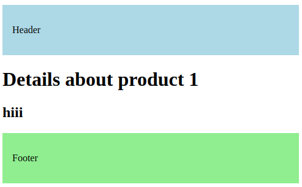

# NextJs_tutorial

## Concept
- a ```page``` is UI that is unique to a route
- a ```layout``` is UI that is shared across multiple pages in the app.
```
        Header          <--- Layout
        /    \
    Page1    Page2      <--- Pages / content
        \    /
        Footer          <--- Layout
```

## Creating Layout
- fix naming convention: ```layout.tsx```
- it takes a ```children``` prop which is a special prop automatically passed by Next.js. It represents the content we put inside the layout component.

for simple example
```tsx
export default function RootLayout({
  children,
}: {
  children: React.ReactNode;
}) {
  return (
    <html lang="en">
      <body>
        {/* head section */}
        <header
          style={{
            backgroundColor: "lightblue",
            padding: "1rem",
          }}
        >
          <p>Header</p>
        </header>

        {/* content section */}

        {children}

        {/* footer section */}
        <footer
          style={{
            backgroundColor: "lightgreen",
            padding: "1rem",
          }}
        >
          <p>Footer</p>
        </footer>
      </body>
    </html>
  );
}
```

## Nested Layout

- ```we can also create custom layout for specific page``` 
```
src
├── app
│   ├── about
|   |   ├── page.tsx
│   │   └── layout.tsx
```

here is the example
```tsx
export default function ProductDetailsLayout({
  children,
}: {
  children: React.ReactNode;
}) {
  return (
    <>
      {children}
      <h2>hiii</h2>
    </>
  );
}
```

in this case, first it will render ```children``` and then ```<h2>hiii</h2>``` and then root layout




## Route Group Layout
- we can also customize layout for specific route group. for that we need to create ```layout.tsx``` in route group folder
```
src
├── app
│   ├── (auth)
|   |   ├── login
|   |   ├── register
|   |   ├── forgot-password
|   |   └── layout.tsx
```
