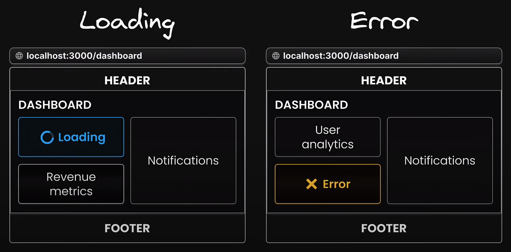
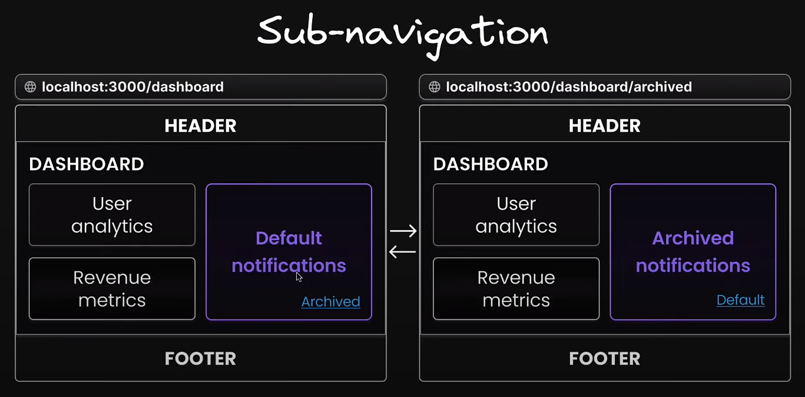
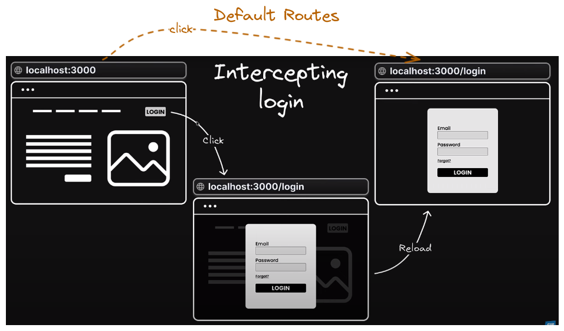
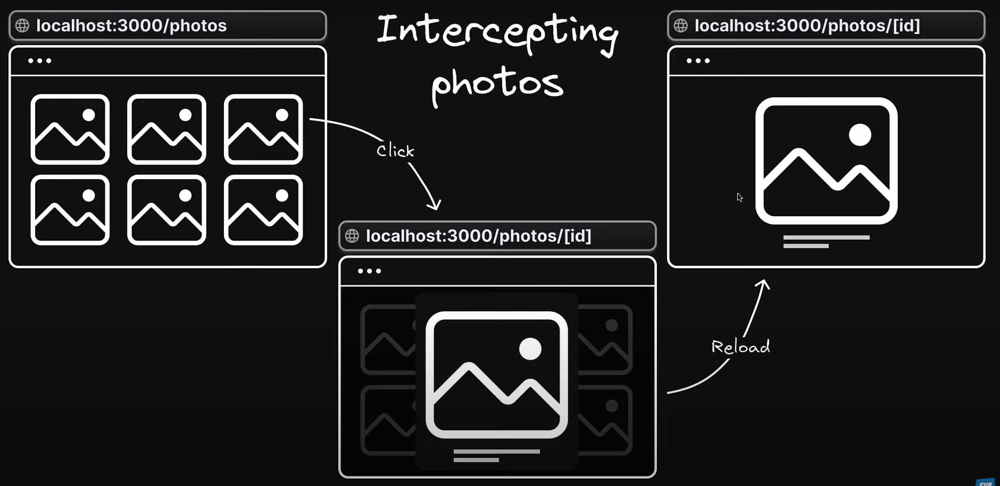

# NextJs_tutorial

## Routing Conventions

Next.js has file-system based routing mechanism.


### Basic Routing ```/pages```

- URL paths that user can access directly in the browser ```are defined by folder in codebase```

> for example you want to access ```/```(home page) and ```/about``` page, <br>
> you need to create following files in your codebase.

```src/app/page.tsx``` => ``` localhost:3000/```

```src/app/about/page.tsx``` => ```localhost:3000/about```

folder structure

```
src
├── app
│   ├── about                   <-- this is for /about
│   │   └── page.tsx
│   └── page.tsx                <-- this is for / (home page)
```


### Nested Routing ```/pages/subpages```

- similar as basic routing
- let create url ```/blog```, ```/blog/first```, ```/blog/second```

the folder structure will be like this

```
src
├── app
│   ├── blog                    <-- this is for /blog
│   │   ├── first               <-- this is for /blog/first
│   │   │   └── page.tsx
│   │   └── second              <-- this is for /blog/second
│   │       └── page.tsx
│   └── page.tsx                <-- this is for / (home page)
```


### Dynamic Routing ```/pages/[param]```

- have to create a folder with ```[<param_name>]``` in the name
- let create url ```/product/1```, ```/product/2```, .... ```/product/n```
  
file structure

```
src
├── app
│   ├── product             <-- this is for /product
│   │   |── [productId]     <-- this is for /product/[productId]
│   │   |    └── page.tsx
|   |   └── page.tsx        
│   └── page.tsx            <-- this is for / (home page)
```           

- to access the param value in ```[productId]/page.tsx```
```tsx

function ProductDetails( {params} : {params: {productId: string}} ) {
    return (
        <div>

            <p>{params.productId}</p>
        </div>
    )
}

```

### Nested Dynamic Routing ```/pages/[param]/subpages```

- let create ```products/[productId]/reviews```, ```products/[productId]/reviews/[reviewId]```
  
file structure

```
src
├── app
│   ├── products                        <-- this is for /products
│   │   |── [productId]                 <-- this is for /products/[productId]
│   │   |    |── reviews                <-- this is for /products/[productId]/reviews
│   │   |    |    └── [reviewId]        <-- this is for /products/[productId]/reviews/[reviewId]
│   │   |    |        └── page.tsx
|   |   |    └── page.tsx        
│   │   └── page.tsx            
```

- to access the param values in ```[reviewId]/page.tsx```
  
```tsx
function ReviewDetails( {params} : {params: {productId: string, reviewId: string}} ) {
    return (
        <div>
            <p>{params.productId}</p>
            <p>{params.reviewId}</p>
        </div>
    )
}
```

### Catch-All Routes ```/pages/[...param]```
- we can use ```/docs/<any_path>``` to catch all routes that start with ```/docs/``` in a single file. we can use ```[...<any_name>]``` to do that.

file structure

```
src
├── app
│   ├── docs                        <-- this is for /docs
│   │   |── [...slug]               <-- this is for /docs/<any_request_url>
│   │   |    └── page.tsx
|   |   └── page.tsx
```

- to access the url in ```[...slug]/page.tsx```

```tsx
function Docs( {params} : {params: {slug: string[]}} ) {
    if (params.slug.length === 2) {
        return (
        <h1>
            Viewing docs for feature : {params.slug[0]} and concept : {params.slug[1]}            
        </h1>
        );
    } else if (params.slug.length === 1) {
        return <h1>Viewing docs for feature : {params.slug[0]}</h1>;
    }

    return <h1>Docs Home Page</h1>;
}
```


### Custom 404 page

- create ```not-found.tsx``` in ```/app``` folder.
- ```file name have to be named like this``` to make it work.

```tsx
export default function NotFound() {
  return (
    <div>
      <h1>404 - Page Not Found</h1>
      <p>could not find your request path</p>
    </div>
  );
}
```

### Redirecting to 404 page from a page

```tsx
import { notFound } from "next/navigation";
```
suppose you want to redirect to 404 page if the reviewId is greater than 1000
```tsx
if (parseInt(params.reviewId) > 1000) {
    return notFound();
  }
```

- if you want to make another custom 404 page for a specific page, you can do it like this.

> create ```not-found.tsx``` in that page folder. For me I want to create a custom 404 page for ```/products/[productId]/reviews/[reviewId]```

file structure

```
src
├── app
│   ├── products                        <-- this is for /products
│   │   |── [productId]                 <-- this is for /products/[productId]
│   │   |    |── reviews                <-- this is for /products/[productId]/reviews
│   │   |    |    |── [reviewId]        <-- this is for /products/[productId]/reviews/[reviewId]
│   │   |    |    |    |── page.tsx
│   │   |    |    |    └── not-found.tsx     <-- this is for /products/[productId]/reviews/not-found.

```
```tsx
export default function ReviewNotFound() {
  return <h1>review not found</h1>;
}
```


### Private Folder
it is a folder that is not accessible from the browser. we can use it to store our private data like api keys, database credentials etc.

- create a folder named ```_<folder_name>``` in ```src/app``` folder. ( like ```_private``` )
file structure
```
src
├── app
│   ├── _private
```


## Route Group
Allows us to logically group our routes and project files without affecting the url. <br>
```
lets implement authentication routes 
    |── Register
    |── Login
    |── Forgot Password
```
- what we can simply do is 
```
src
├── app
│   ├── auth
│   │   ├── login                       <-- this is for /auth/login
│   │   │   └── page.tsx
│   │   ├── register                    <-- this is for /auth/register
│   │   │   └── page.tsx
│   │   └── forgot-password             <-- this is for /auth/forgot-password
│   │       └── page.tsx
```
- in some case it is not ideal. yet we can use ```route group``` to solve this problem.
- to create a route group, we have to simply name the folder like : ```(<group_name>)```
- ```(auth)``` => means that auth name will be excluded from the url.
```
src
├── app
│   ├── (auth)
│   │   ├── login                       <-- this is for /login
│   │   │   └── page.tsx
│   │   ├── register                    <-- this is for /register
│   │   │   └── page.tsx
│   │   └── forgot-password             <-- this is for /forgot-password
│   │       └── page.tsx
```


# Parallel Routes(Advanced Routing)
```Parallel Routes``` are advanced routing mechanism  that allows for the simultaneous rendering of multiple within the same layout.<br>


>suppose we want to create a complex dashboard that includes multiple sections. Like this


- In a traditional way it is done like this.
```tsx
import UserAnalytics from "@/users/UserAnalytics";
import RevenewMetrics from "@/components/RevenewMetrics";
import Notifications from "@/components/Notifications";

export default function DashboardLayout({
  children,
}: {
  children: React.ReactNode;
}) {
  return (
    <>
      <div>children</div>
      <UserAnalytics />
      <RevenewMetrics />
      <Notifications />
    </>
  );
}
```
but this doesn't renders the components at once. it renders one by one. so it is not ideal for complex dashboard. for this we need to use ```Parallel Routes```

- Parallel routes are defined using a feature known as ```slots``` 
- ```Slots``` help structure our content in a modular fashion 
- to define a ```Slot```, we use the ```@<folder_name>``` naming convention 
- each ```Slot``` is then passed as a prop to its corresponding ```layout.tsx``` file

file structure
```src
├── app
│   ├── complex_dashboard
│   │   ├── @notifications
│   │   │   └── page.tsx
│   │   ├── @revenue
│   │   │   └── page.tsx
│   │   ├── @users
│   │   │   └── page.tsx
│   │   ├── layout.tsx
│   │   └── page.tsx
```
then we can use them as 
```tsx
export default function DashboardLayout({
  children,
  users,
  revenue,
  notifications,
}: {
  children: React.ReactNode;
  users: React.ReactNode;
  revenue: React.ReactNode;
  notifications: React.ReactNode;
}) {
  return (
    <>
      <div>{children}</div>
      <div style={{ display: "flex" }}>
        <div style={{ display: "flex", flexDirection: "column" }}>
          <div>{users}</div>
          <div>{revenue}</div>
        </div>
        <div style={{ display: "flex", flex: 1 }}>{notifications}</div>
      </div>
    </>
  );
}
```
**Benefits of using Parallel Routes -> ```Independent Route Handling```**


**Benefits of using Parallel Routes -> ```Sub-navigation in routes```** <br>
- each ```Slot``` functions as a mini-application with its own navigation and state management.



```tsx
export default function Notifications() {
  return (
    <Card>
      <div>Notifications</div>
      <Link href="/complex_dashboard/archived"> Archived </Link>
    </Card>
  );
}
```
for this to implement
```
src
├── app
│   ├── complex_dashboard
│   │   ├── @notifications
│   │   │   |── archived
│   │   │   │   └── page.tsx
│   │   │   └── page.tsx
```
```tsx
import Card from "@/components/card";
import Link from "next/link";

export default function ArchivedNotifications() {
  return (
    <Card>
      <div>Archived Notifications</div>
      <Link href="/complex_dashboard"> Archived </Link>
    </Card>
  );
}
```

**but the problem arose when we are at ```/complex_dashboard/archived``` and we refresh the page. it will show 404 page.** <br>
Because it is navigated within the UI. and Next.js retains previous active state of other slots regardless of changes in the URL. <br>
But when page refreshes, Next.js can't retrieve other slot's active state from the current URL.
because ```/complex_dashboard/archived``` is not an ```unmatched route(routing within the UI)``` <br>

- that's why we need ```default.tsx``` file
  
```default.tsx``` file serves as a ```fallback``` to render content when the framework ```can't retrieve a slot's active state``` from the current URL <br>

so to work
```
src
├── app
│   ├── complex_dashboard
│   │   ├── @notifications
│   │   ├── @revenue
│   │   |   ├── default.tsx         <--
│   │   │   └── page.tsx
│   │   ├── @users
│   │   |   ├── default.tsx         <--
│   │   │   └── page.tsx
│   │   ├── layout.tsx
│   │   ├── default.tsx             <--
│   │   └── page.tsx
```
the content of ```default.tsx``` file may be mirror of ```page.tsx``` file or custom content.


## Conditional Routing
suppose for who is logged in, we want to show ```/complex_dashboard``` page and for who is not logged in, we want to show ```/login``` page. <br>

for this we can add extra ```Slot```
```
src
├── app
│   ├── complex_dashboard
│   │   ├── @login
│   │   │   └── page.tsx
│   │   ├── @notifications
│   │   ├── @revenue
│   │   ├── @users
│   │   ├── layout.tsx
│   │   ├── page.tsx
```
in ```layout.tsx``` file
```tsx
export default function DashboardLayout({
  children,
  users,
  revenue,
  notifications,
  login,
}: {
  children: React.ReactNode;
  users: React.ReactNode;
  revenue: React.ReactNode;
  notifications: React.ReactNode;
  login: React.ReactNode;                           <---------------
}) {
  const isLoggedIn = false;                         <---------------

  return isLoggedIn ? (
    <>
      <div>
        <h1>{children}</h1>
        <div style={{ display: "flex" }}>
          <div style={{ display: "flex", flexDirection: "column" }}>
            <div>{users}</div>
            <div>{revenue}</div>
          </div>
          <div style={{ display: "flex", flex: 1 }}>{notifications}</div>
        </div>
      </div>
    </>
  ) : (
    <>
      <div>{login}</div>                            <---------------
    </>
  );
}
```


# Intercepting Routes (Advanced Routing)

let's look at the examples <br>
 <br>
similarly<br>


- ```intercepting routes``` allow you to intercept or stop the default routing behaviour to ```present an alternate view or component``` when navigating throgh the ```UI``` while preserving the intended route for scenarios like ```page refresh```
  
- **useful if you want to show a route while keeping the context of the current page**

### convention
name the intended intercepting route folder as : 
- ```(.)<route/folder_name>``` to match segements on the ```same level```
- ```(..)<route/folder_name>``` to match segements on ```one level above```
- ```(..)(..)<route/folder_name>``` to match segements on ```two level above``` **but there is an issue on this, which is not solved yet**
- ```(...)<route/folder_name>``` to match segements on ```root level```


for example: <br>
we have routes like this
```
src
├── app
│   ├── f1
│   │   ├── page.tsx          <--- contains link to /f1/f2
│   │   ├── f2
│   │   │   └── page.tsx
│   │   ├── f3
│   │   │   └── page.tsx      <--- contains link to /about
│   │   ├── f4
│   │   │   └── page.tsx      <--- contains link to /f1/f3
```

- ```f1```'s ```page.tsx``` and ```f2 route``` are on the same level.
so,
```
src
├── app
│   ├── f1
│   │   ├── page.tsx          <--- contains link to /f1/f2
|   |   ├── (.)f2             <--- intercepting route
│   │   │   └── page.tsx
│   │   ├── f2                <--- real route
│   │   │   └── page.tsx
```

- but ```f4```'s ```page.tsx``` and ```f3 route``` are not on the same level. f3 route is one level above.
so,
```
src
├── app
│   ├── f1
│   │   ├── page.tsx       
│   │   ├── f3                      <--- real route
│   │   ├── f4
│   │   │   ├── page.tsx            <--- contains link to /f1/f3
|   |   │   └── (..)f3              <--- intercepting route
│   │   │        └──  page.tsx           
```

- ```f3```'s ```page.tsx``` contains link to ```/about``` route. ```about``` route is on the root level.
so,
```
src
├── app
│   ├── about                       <--- real route
│   ├── f1
|   |   ├── f3
|   |   |   ├── page.tsx            <--- contains link to /about
|   |   |   └── (..)about           <--- intercepting route
│   │   │        └──  page.tsx           
```


## Practical Example of intercepting routes

<br>

- i created a route ```/photo_feed``` for this
check the corresponding files 
```
src
├── app
│   └── photo_feed     <---- this the route
└── components
    └── modal.tsx        
```
