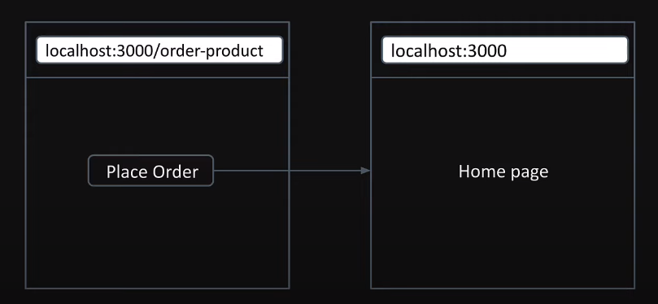

# Navigation
2 types of navigation:
- **UI navigation**: clicking on a link or button to navigate to a new page
- **Programmatic navigation**: navaigating to a new page after some event occurs in the app

## UI navigation
- we will use ```Link``` component 

suppose in our home page
```tsx
import Link from "next/link";

export default function Home() {
  return (
    <>
      <h1> Hello World!! Welcome to Home </h1>
      <Link href="/about">About</Link>
      <br />
      <Link href="/products">Product</Link>
      <br />
      <Link href="/blog">Blog</Link>
    </>
  );
}
```

## Programmatic navigation
 <br>
in ```src/app/order_product/page.tsx```
```tsx
"use client";
import { useRouter } from "next/navigation";

export default function OrderProduct() {
  const router = useRouter();

  const handleClick = () => {
    console.log("Placing order...");
    router.push("/");
  };

  return (
    <>
      <h1>Order Product</h1>
      <button onClick={handleClick}>Place Order</button>
    </>
  );
}
```


## loading.tsx
 this file allows us to create loading states that are displayed to users while a specific route segment's content is loading. <br>
 The loading state appears immediately upon navigation.

 - simply need to create a ```loading.tsx``` file in the same directory as the page we want to add a loading state to

let's add a loading state in blog
```
src
├── app
│   ├── blog
│   │   ├── loading.tsx
```
```tsx
export default function Loading() {
  return (
    <div>
      <h2>Loading...</h2>
    </div>
  );
}
```

**benefits of using loading.tsx**
- display loading state as soon as a user navigates to a new route
- users can continue interacting with certain parts of the application, such as the navigation menu, even if the main content is still being fetched


## error handling

suppose we have unhandeled error in ```/products/[productId]/reviews/[reviewId]/page.tsx```
```tsx
function getRandomInt(count: number) {
  return Math.floor(Math.random() * count);
}

export default function ReviewDetails({
  params,
}: {
  params: { productId: string; reviewId: string };
}) {
  const random = getRandomInt(2);
  if (random === 1) {
    throw new Error("Error Loading Review");
  }
    ......
}
```

to handle this error we need to create ```error.tsx``` in the same directory.
```tsx
"use client";

export default function ErrorBoundary() {
  return <h1>Error in Review</h1>;
}
```
to show what the error is we can use ```error.message```
```tsx
export default function ErrorBoundary({ error }: { error: Error }) {
  return <h1>Error in Review : {error.message} </h1>;
}
```

- sometimes to recover from an minor error we have to just ```try again```.
```tsx
"use client";

export default function ErrorBoundary({
  error,
  reset,
}: {
  error: Error;
  reset: () => void;
}) {
  return (
    <div>
      <h2>Error</h2>
      <p>{error.message}</p>
      <button onClick={reset}>Try Again</button>
    </div>
  );
}
```

to make it work we need to include ```"use client";``` in page.tsx


